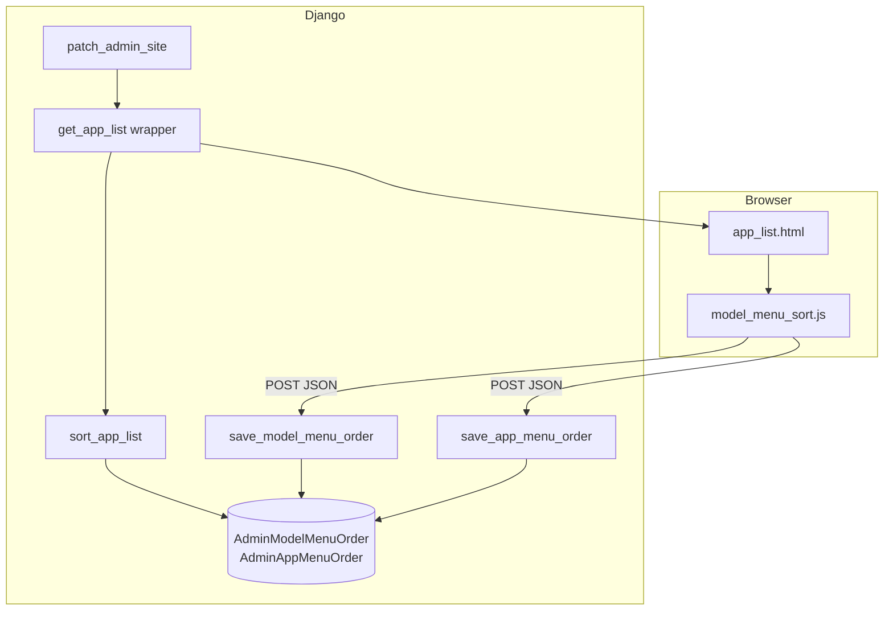

# Django Admin — Sürükle-Bırak Menü Sıralama

Django yönetim panelinde (`/admin/`) **uygulama tablolarının** (Api, Currency, Auth …) ve her tablo içindeki **model satırlarının** kullanıcıya özel sürükle-bırak ile sıralanmasını sağlayan, harici bağımlılık gerektirmeyen bir eklenti.

Bu belge, özelliği başka Django projelerine taşımak veya açık kaynak olarak paylaşmak için yazılmıştır.

---

## İçindekiler

1. [Ne yapar?](#ne-yapar)
2. [Özellikler ve sınırlar](#özellikler-ve-sınırlar)
3. [Mimari](#mimari)
4. [Dosya yapısı](#dosya-yapısı)
5. [Kurulum (başka projeye taşıma)](#kurulum-başka-projeye-taşıma)
6. [Veritabanı modelleri](#veritabanı-modelleri)
7. [Backend: `admin_menu.py`](#backend-admin_menupy)
8. [Şablon: `app_list.html`](#şablon-app_listhtml)
9. [Frontend: JavaScript ve CSS](#frontend-javascript-ve-css)
10. [Uygulama başlatma (`AppConfig.ready`)](#uygulama-başlatma-appconfigready)
11. [API uç noktaları](#api-uç-noktaları)
12. [Sıralama algoritması](#sıralama-algoritması)
13. [Güvenlik](#güvenlik)
14. [Özelleştirme](#özelleştirme)
15. [Sorun giderme](#sorun-giderme)
16. [Referans: QRmenu uygulaması](#referans-qrmenu-uygulaması)

---

## Ne yapar?

Django admin ana sayfası (`/admin/`), varsayılan olarak uygulamaları `INSTALLED_APPS` sırasına ve modelleri kayıt sırasına göre listeler. Bu özellik:

| Seviye | Nerede | Nasıl | Kalıcılık |
|--------|--------|-------|-----------|
| **Uygulama tabloları** | Yalnızca `/admin/` (birden fazla uygulama varken) | Tablo başlığındaki ⠿ tutamacı | `AdminAppMenuOrder` — kullanıcı + `app_label` |
| **Model satırları** | Ana sayfa ve tek uygulama sayfası (`/admin/api/` vb.) | Satır başındaki ⠿ tutamacı | `AdminModelMenuOrder` — kullanıcı + `app_label` + `model_name` |

Her staff kullanıcı kendi sırasını görür; başka kullanıcıların tercihleri etkilenmez.

---

## Özellikler ve sınırlar

### Özellikler

- Harici kütüphane yok (SortableJS, jQuery UI vb. gerekmez).
- Yerel HTML5 Drag and Drop API.
- `admin.site.get_app_list` monkey-patch ile tüm kayıtlı admin uygulamalarına otomatik uygulanır.
- Kayıt sırası sunucuda doğrulanır; yalnızca gerçekten admin’e kayıtlı `app_label` / `model_name` kabul edilir.
- CSRF korumalı POST istekleri.
- Django admin teması CSS değişkenlerine (`--link-fg`, `--body-quiet-color` …) uyumlu stiller.

### Sınırlar

- Sıralama **yalnızca admin index ve app index** görünümlerini etkiler; sol navigasyon çubuğu (`nav_sidebar`) ayrı bir `app_list.html` include kullanır ve bu belgedeki şablon onu değiştirmez.
- Uygulama tablosu sıralaması, tek uygulama sayfasında (`app_label` context değişkeni varken) devre dışıdır.
- Yeni eklenen model/uygulama, kullanıcının kayıtlı sırasında yoksa **listenin sonuna** (order = 10 000 fallback) düşer.
- Sürükleme yalnızca tutamak (`mousedown`) ile etkinleştirilir; link tıklamaları yanlışlıkla sürüklemeyi tetiklemez.

---

## Mimari



**Akış:**

1. `AppConfig.ready()` → `patch_admin_site()` admin site’a sarıcı ekler.
2. Her admin sayfa yüklemesinde `get_app_list` → `sort_app_list` DB’den kullanıcı sırasını okur.
3. Kullanıcı sürükleyip bırakınca JS DOM sırasını toplar ve ilgili endpoint’e POST eder.
4. View kayıtları `update_or_create` ile yazar; artık listede olmayan eski kayıtları siler.

---

## Dosya yapısı

Bağımsız bir Django uygulaması (`admin_menu_sort` gibi) veya mevcut bir app içine eklenebilir. QRmenu’de `api` uygulaması altındadır:

```
your_app/
├── admin_menu.py              # patch, sort, API view’lar
├── models.py                  # AdminModelMenuOrder, AdminAppMenuOrder
├── apps.py                    # ready() içinde patch_admin_site()
├── migrations/
│   └── XXXX_admin_menu_order.py
├── templates/
│   └── admin/
│       └── app_list.html      # Django varsayılanının override’ı
└── static/
    └── admin/
        └── your_app/          # veya ortak bir namespace
            ├── model_menu_sort.js
            └── model_menu_sort.css
```

**Önemli:** `templates/admin/app_list.html` yolu Django’nun admin şablon arama sırasında `django.contrib.admin` şablonlarının **üzerine** yazılır. Bunun için uygulamanız `INSTALLED_APPS` içinde `django.contrib.admin`’den **sonra** listelenmelidir.

---

## Kurulum (başka projeye taşıma)

### 1. Dosyaları kopyalayın

Aşağıdaki dosyaları projenize taşıyın (isimleri ihtiyaca göre uyarlayın):

- `admin_menu.py`
- İki model sınıfı (`models.py` veya `models/admin_menu.py`)
- `templates/admin/app_list.html`
- `static/admin/.../model_menu_sort.js`
- `static/admin/.../model_menu_sort.css`

QRmenu kaynak yolları:

| Dosya | Konum |
|-------|--------|
| Backend mantığı | `api/admin_menu.py` |
| Modeller | `api/models.py` (`AdminModelMenuOrder`, `AdminAppMenuOrder`) |
| Şablon | `api/templates/admin/app_list.html` |
| JS / CSS | `api/static/admin/api/model_menu_sort.js`, `.css` |
| Başlatma | `api/apps.py` → `ready()` |

### 2. `INSTALLED_APPS`

```python
INSTALLED_APPS = [
    "django.contrib.admin",
    # ...
    "your_app",  # admin'den sonra
]
```

### 3. `AppConfig.ready`

```python
# your_app/apps.py
from django.apps import AppConfig


class YourAppConfig(AppConfig):
    default_auto_field = "django.db.models.BigAutoField"
    name = "your_app"

    def ready(self):
        from .admin_menu import patch_admin_site

        patch_admin_site()
```

`settings.py` içinde `default_app_config` veya `YourAppConfig` tam yolu kullanın:

```python
"your_app.apps.YourAppConfig",
```

### 4. Migrasyon

```bash
python manage.py makemigrations your_app
python manage.py migrate
```

### 5. Statik dosyalar

Geliştirmede `runserver` statikleri sunar. Production’da `collectstatic` çalıştırın.

Şablondaki `` yolunu kopyaladığınız dizinle eşleştirin.

### 6. Doğrulama

```bash
python manage.py check
```

Tarayıcıda `/admin/` açın; birden fazla uygulama varsa tablo başlıklarında ve model satırlarında ⠿ tutamaçları görünmelidir.

---

## Veritabanı modelleri

### `AdminModelMenuOrder`

Bir kullanıcının belirli bir Django uygulaması (`app_label`) içindeki model satırları sırası.

| Alan | Tip | Açıklama |
|------|-----|----------|
| `user` | FK → `AUTH_USER_MODEL` | Sırayı saklayan kullanıcı |
| `app_label` | `CharField(100)` | Örn. `api`, `currency` |
| `model_name` | `CharField(100)` | Model sınıf adı (`object_name`), örn. `Product` |
| `order` | `PositiveIntegerField` | 0 tabanlı sıra |

**Unique:** `(user, app_label, model_name)`

### `AdminAppMenuOrder`

Ana admin sayfasındaki uygulama tablolarının sırası.

| Alan | Tip | Açıklama |
|------|-----|----------|
| `user` | FK → `AUTH_USER_MODEL` | |
| `app_label` | `CharField(100)` | |
| `order` | `PositiveIntegerField` | |

**Unique:** `(user, app_label)`

### `TimeStampedModel` bağımlılığı

QRmenu’de modeller `core.models.TimeStampedModel` (abstract, `created_at` / `updated_at`) kullanır. Başka projede yoksa düz `models.Model` yeterlidir:

```python
from django.conf import settings
from django.db import models


class AdminModelMenuOrder(models.Model):
    user = models.ForeignKey(
        settings.AUTH_USER_MODEL,
        on_delete=models.CASCADE,
        related_name="admin_model_menu_orders",
    )
    app_label = models.CharField(max_length=100)
    model_name = models.CharField(max_length=100)
    order = models.PositiveIntegerField(default=0)

    class Meta:
        constraints = [
            models.UniqueConstraint(
                fields=["user", "app_label", "model_name"],
                name="unique_admin_model_menu_order",
            ),
        ]
        ordering = ["order", "pk"]


class AdminAppMenuOrder(models.Model):
    user = models.ForeignKey(
        settings.AUTH_USER_MODEL,
        on_delete=models.CASCADE,
        related_name="admin_app_menu_orders",
    )
    app_label = models.CharField(max_length=100)
    order = models.PositiveIntegerField(default=0)

    class Meta:
        constraints = [
            models.UniqueConstraint(
                fields=["user", "app_label"],
                name="unique_admin_app_menu_order",
            ),
        ]
        ordering = ["order", "pk"]
```

Modelleri admin’e kaydetmek zorunlu değildir; debug için isteğe bağlı `ModelAdmin` eklenebilir.

---

## Backend: `admin_menu.py`

### `patch_admin_site()`

- Tekrarlı patch’i önlemek için `site._model_menu_order_patched` bayrağı kullanır.
- `admin.site.get_app_list` sarmalanır → çıktı `sort_app_list` ile sıralanır.
- `admin.site.get_urls` genişletilir → iki custom URL eklenir.

### `sort_app_list(app_list, user)`

1. Her `app` için `AdminModelMenuOrder` kayıtlarına göre `app["models"]` listesi sıralanır.
2. Ardından `AdminAppMenuOrder` kayıtlarına göre tüm `app_list` sıralanır.
3. Oturum açmamış kullanıcıda liste değiştirilmez.

### Yardımcılar

- `get_registered_app_labels()` — `admin.site._registry` üzerinden kayıtlı uygulama etiketleri.
- `get_registered_model_names(app_label)` — ilgili uygulamadaki kayıtlı model `object_name` kümesi.

Kayıt doğrulaması, istemciden gelen sıra listesinin manipülasyonunu sınırlar.

---

## Şablon: `app_list.html`

Django’nun `django/contrib/admin/templates/admin/app_list.html` dosyasının genişletilmiş hali.

### Kritik context değişkenleri

| Değişken | Anlam |
|----------|--------|
| `app_list` | Uygulama dict listesi (`app_label`, `name`, `models`, …) |
| `app_label` | **Yalnızca** app index sayfasında set edilir; ana index’te yoktur |
| `show_changelinks` | Index’te `True`, sidebar include’da `False` |

### Uygulama sıralama UI koşulu

```django

```

- Ana sayfada birden fazla uygulama tablosu varken `.js-admin-app-sortable` sarmalayıcı ve başlık tutamacı gösterilir.
- `/admin/myapp/` gibi tek uygulama sayfalarında uygulama seviyesi sürükleme kapalıdır.

### Model sıralama UI

Her `<tbody>`:

- Sınıf: `js-admin-model-sortable`
- `data-app-label="{{ app.app_label }}"`
- `data-save-url=""`

Her satır:

- `data-model-name="{{ model.object_name }}"` — API’ye giden ad (`Product`, `Category`, …)
- İlk sütun: `.admin-model-sort-handle` (⠿)

### Statik asset yüklemesi

Şablon sonunda CSS ve JS doğrudan include edilir (admin index her yüklendiğinde). Alternatif olarak `AdminSite.each_context` veya `ModelAdmin.Media` ile de yüklenebilir; mevcut yaklaşım kurulumu basitleştirir.

---

## Frontend: JavaScript ve CSS

### JavaScript (`model_menu_sort.js`)

Vanilla IIFE; `DOMContentLoaded` sonrası:

- `.js-admin-model-sortable` → `initSortableTable`
- `.js-admin-app-sortable` → `initSortableApps`

**Sürükleme modeli:**

1. Tutamaçta `mousedown` → `draggable = true`
2. `dragstart` → görsel sınıf (`is-dragging` / `is-dragging-app`)
3. `dragover` → hedef öğenin üst/alt yarısına göre `before()` / `after()`
4. `dragend` → `draggable = false`, `fetch` ile sıra kaydı

**CSRF:** Cookie’den `csrftoken` okunur; `X-CSRFToken` header’ı ile gönderilir.

Harici bağımlılık yok; Django 4.x–6.x admin ile uyumludur.

### CSS (`model_menu_sort.css`)

- Tutamaç imleci: `grab` / `grabbing`
- Sürüklenen öğe: düşük opacity, kesik çizgi outline
- Admin dark/light tema uyumu için CSS custom properties fallback’leri

---

## Uygulama başlatma (`AppConfig.ready`)

Patch’in **bir kez** ve uygulama registry hazır olduktan sonra çalışması gerekir. `ready()` uygun yerdir.

**Dikkat:** Test suite’lerinde veya migration sırasında admin import yan etkileri oluşturuyorsa, patch’i yalnızca `RUN_MAIN` veya `not sys.argv[1:] == ['migrate']` gibi koşullarla sınırlamayı değerlendirin (çoğu projede gerekmez).

---

## API uç noktaları

Her iki endpoint de `admin.site.admin_view` ile sarılır → staff + admin oturumu gerekir.

### `POST /admin/save-model-menu-order/`

**Content-Type:** `application/json`

```json
{
  "app_label": "api",
  "model_names": ["Product", "Category", "SiteSettings"]
}
```

**Başarı:** `{"ok": true}`

**Hatalar:** 400 — geçersiz JSON, bilinmeyen `app_label`, boş liste, kayıtlı olmayan model adları filtrelenince liste boş kalırsa.

**Sunucu davranışı:**

- Sıradaki her model için `update_or_create(user, app_label, model_name, order=index)`
- Aynı `(user, app_label)` için gönderilmeyen eski kayıtlar silinir

### `POST /admin/save-app-menu-order/`

```json
{
  "app_labels": ["api", "currency", "localization", "auth"]
}
```

**Sunucu davranışı:** Aynı mantık; `AdminAppMenuOrder` üzerinde.

---

## Sıralama algoritması

Kayıtlı sırada olmayan öğeler için sort key:

```python
order_map.get(name, 10_000)
```

İkincil sıralama:

- Modeller: alfabetik `model["name"]`
- Uygulamalar: `app["name"].lower()`

Böylece yeni kayıt edilen modeller/uygulamalar kullanıcının özelleştirdiği bloğun **altında**, tutarlı bir alt sıra ile görünür.

---

## Güvenlik

| Konu | Uygulama |
|------|----------|
| Yetkilendirme | `admin_view` decorator |
| CSRF | POST + `X-CSRFToken` |
| Girdi doğrulama | Yalnızca admin registry’deki label/name |
| Tekrarlayan adlar | Sunucu tarafında dedupe |
| XSS | JSON yanıt; şablonda kullanıcı girdisi yok |

Sıra verisi yalnızca UI tercihidir; yetki veya model erişimini değiştirmez.

---

## Özelleştirme

### Sol navigasyon çubuğu

`nav_sidebar.html` şunu include eder:

```django

```

Aynı şablon kullanıldığı için model satırı tutamaçları sidebar’da da görünebilir. Uygulama seviyesi sarmalayıcı yine `not app_label` koşuluna bağlıdır. Sidebar’da sürüklemeyi kapatmak için şablonda `request.resolver_match.url_name` veya ek context ile koşul eklenebilir.

### Çeviri

Kullanıcı metinleri `` ile sarılmıştır. Kendi `locale/` dosyalarınıza ekleyin veya metinleri değiştirin.

### Tutamaç simgesi

Varsayılan: `⠿` (U+283F BRAILLE PATTERN DOTS-123456). FontAwesome veya SVG ile değiştirilebilir; JS yalnızca `.admin-model-sort-handle` / `.admin-app-sort-handle` sınıflarına bağlıdır.

### Statik dosya yolu

Şablondaki:

```django

```

Projenize göre güncelleyin (ör. `admin/admin_menu_sort/model_menu_sort.css`).

### Ayrı reusable paket

PyPI paketi yapmak için:

1. `admin_menu_sort` adında minimal Django app
2. `default_app_config` / `AppConfig` ile otomatik `ready()` patch
3. `templates/` ve `static/` app dizininde
4. README’de bu belgenin kısaltılmış kurulum adımları

---

## Sorun giderme

| Belirti | Olası neden | Çözüm |
|---------|-------------|--------|
| Tutamaç yok | Şablon override yüklenmiyor | App `INSTALLED_APPS` sırası; `templates/admin/app_list.html` yolu |
| Sıra kaydolmuyor | 403 CSRF | Oturum/cookie; `CsrfViewMiddleware` |
| 404 POST | Patch çalışmıyor | `ready()` içinde `patch_admin_site()` çağrısı |
| Sıra sayfa yenileyince eski | Migrate yapılmadı | `migrate`; tabloların varlığını kontrol edin |
| Uygulama sürüklenmiyor | Tek uygulama veya app index | Normal; yalnızca `/admin/` ana index |
| CSS/JS 404 | Statik yol | `collectstatic`; `` yolu ile dosya konumu eşleşmesi |

Tarayıcı geliştirici araçları → Network sekmesinde `save-model-menu-order/` ve `save-app-menu-order/` isteklerini kontrol edin.

---

## Referans: QRmenu uygulaması

| Bileşen | Dosya |
|---------|--------|
| Modeller | `Backend/api/models.py` — `AdminModelMenuOrder`, `AdminAppMenuOrder` |
| Patch & API | `Backend/api/admin_menu.py` |
| App config | `Backend/api/apps.py` |
| Şablon | `Backend/api/templates/admin/app_list.html` |
| JS | `Backend/api/static/admin/api/model_menu_sort.js` |
| CSS | `Backend/api/static/admin/api/model_menu_sort.css` |
| Migrasyonlar | `0025_admin_model_menu_order`, `0026_admin_app_menu_order` |

**Test edildi:** Django 6.0.x admin arayüzü.

---

## Lisans ve katkı

Bu kod QRmenu projesinin parçasıdır. Başka projelere kopyalarken:

1. Dosyaları olduğu gibi veya bağımsız paket olarak taşıyın.
2. `INSTALLED_APPS`, statik yollar ve isteğe bağlı `TimeStampedModel` bağımlılığını uyarlayın.
3. Projenizin lisansına uygun atıf ekleyin.

Geliştirme önerileri (opsiyonel):

- Sol sidebar için ayrı şablon parçası (`app_list_sortable_rows.html`)
- Sıfırlama butonu (“Varsayılan sıraya dön”)
- `AdminSite` subclass ile patch’siz entegrasyon
- SortableJS ile dokunmatik cihaz desteği iyileştirmesi

---

*Son güncelleme: QRmenu — Django admin sürükle-bırak menü sıralama belgesi.*
